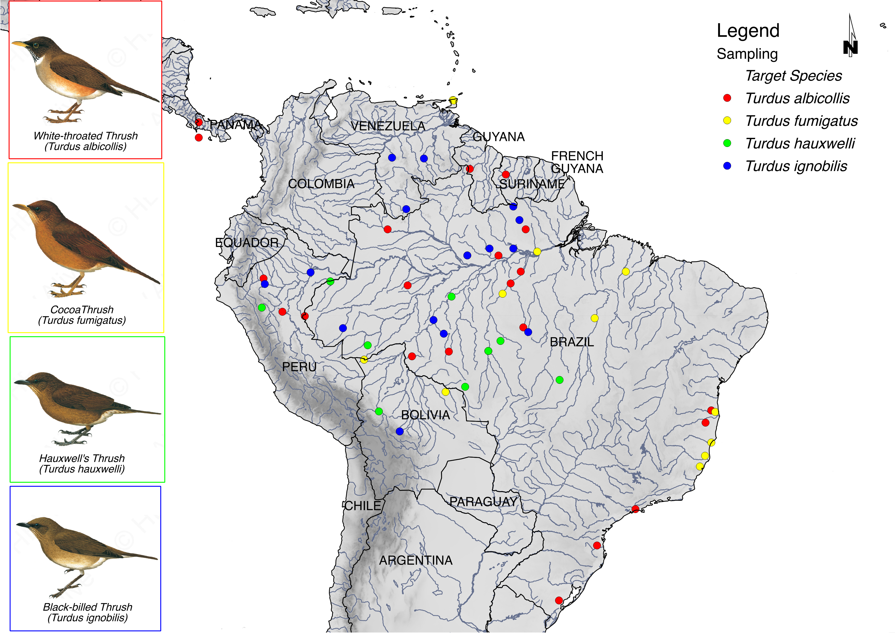

### Authors
---

##### Romina Batista1,2,4, Tobias Hoffmann2,3, Urban Olsson3,4, Alexandre Aleixo5, Alexandre Antonelli3,4, Joel Cracraft1,2, Camila Ribas8
---

1Programa de Pós-Graduação em Genética, Conservação e Biologia Evolutiva, PPG ([GCBEV](http://gcbev.inpa.gov.br/))  - Instituto Nacional de Pesquisas da Amazônia - INPA ([INPA](http://portal.inpa.gov.br/)) Campus II. Av. André Araújo, 2936 – Petrópolis - CEP 69067-375, Manaus, AM, Brazil

2Gothenburg Global Biodiversity Centre, Box 461, SE-405 30 Gothenburg, Sweden

3University of Gothenburg - Department of Biological and Environmental Sciences, [The Antonelli Lab](http://www.antonelli-lab.net/), [Antonelli-Lab Github](https://github.com/AntonelliLab), SE-413 19 Gothenburg, Sweden 

8Instituto Nacional de Pesquisas da Amazônia - INPA ([INPA](http://portal.inpa.gov.br/)) Campus II. Av. André Araújo, 2936 – Petrópolis - CEP 69067-375, Manaus, AM, Brazil

               

---

### Overview
---

The genus *Turdus* (Aves, Turdidae) consists of 71 currently recognised species occurring throughout the world. Previous attempts to reconstruct phylogenies have proved extremely challenging due to short internal branches and low node support. South and Central America currently host the highest number of species (23 of 71) in the genus Turdus (Aves: Turdidae), and previous studies ([Nylander et al, 2008](http://sysbio.oxfordjournals.org/content/57/2/257.full.pdf+html)) suggest that this is due to an exceptional radiation following dispersal from Africa (see below, Figure 1, from [Nylander et al, 2008](http://sysbio.oxfordjournals.org/content/57/2/257.full.pdf+html)). Detailed biogeographic studies on a finer scale in South America are necessary to examine the evolutionary history for these taxa, as well as for revising current taxonomy. 

The application of Ultraconserved Elements ([UCEs](http://ultraconserved.org/)) is currently one of the most popular methods for phylogenomics using reduced representation genomic datasets. UCEs are highly conserved across distantly related taxa and have variable flanking regions. These characteristics make UCEs useful genetic markers for both deep and shallow evolutionary timescales, and they have successfully been used to resolve challenging phylogenetic relationships among many taxa (eg. birds, turtles, fishes). 

Here, we sequenced ~2,386 UCEs loci and 47 loci, used in previous phylogenetic studies for birds, for 102 individuals of 11 species of the genus *Turdus* sampled across South and Central America (see Image below).

 

---

### Collaborator Roles
---

*	The Project was conceived and designed by [Romina Batista](http://buscatextual.cnpq.br/buscatextual/visualizacv.do?id=K4232850J7), [Urban Olsson](http://bioenv.gu.se/personal/Olsson_Urban), [Alexandre Antonelli](http://www.antonelli-lab.net/) and [Camila Ribas](http://buscatextual.cnpq.br/buscatextual/visualizacv.do?id=K4760723U4). 

*	Romina Batista extracted DNA and sent outsourcing ([Rapid Genomics](http://www.rapid-genomics.com/)) to proceed with Library Preparation, Sequence Capture and Sequencing. 

*	Romina Batista processed the data, with [Tobias Hoffmann](https://github.com/tobiashofmann88) guidance. 

*	Romina Batista built this repository.

*	Romina Batista is analysing the data, and leading manuscript preparation. 

*	All collaborators are involved in discussions, and interpreting results.

---

### Funding
---

Funding for this project came from: 

1. NATIONAL SCIENCE FOUNDATION and FUNDAÇÃO DE AMPARO À PESQUISA DO ESTADO DE SÃO PAULO - FAPESP: 2012/50260-6, TITLE OF THE PROJECT "ASSEMBLY AND EVOLUTION OF THE AMAZONIAN BIOTA AND ITS ENVIRONMENT: AN INTEGRATED APPROACH". Principal Investigators (PI): [Lúcia Lohmann](http://lattes.cnpq.br/3340828165410597)
(IB-USP) e [Joel Cracraft](http://www.amnh.org/our-research/staff-directory/joel-l.-cracraft/) (AMNH). 

2. Coordination for the Improvement of Higher Education Personnel (CAPES), A Doctoral Fellowship for Interneship abroad to Romina Batista. 

3. The Antonelli Lab (funding provided to Alexandre Antonelli from the European Research Council under the European Union’s Seventh Framework Programme [FP/2007-2013, ERC Grant Agreement n. 331024], the Wallenberg Foundation for a  Wallenberg Academy Fellowship, and the Swedish Research Council [2015-04857]).  

---

### Acknowledgements
--- 

We would like to thank the many institutions that provided tissue loans for this research: 

*	Instituto Nacional de Pesquisas da Amazônia, INPA, Manaus, Brazil ([INPA](https://www.inpa.gov.br/));

*	Field Museum of Natural History, Louisiana State University Museum of Natural Science, Louisiana State, USA ([LSU](http://www.museum.lsu.edu/MNS/birdcoll.html)); 

*	Museu Paraense Emílio Goeldi, MPEG, Belém, PA, Brazil ([MPEG](http://www.museu-goeldi.br/portal/content/coleções-de-científicas)); 

*	Laboratório de Genética e Evolução Molecular de Aves, LGEMA, Departamento de Genética e Biologia Evolutiva do Instituto de Biociências da Universidade de São Paulo-USP ([LGEMA](http://www.ib.usp.br/biologia/lgema/)); 

*	Divisão de Aves do Museu de Zoologia da Universidade Estadual de Feira de Santana, DAMZFS, Feira de Santana, Bahia, Brazil;

*	American Museum of Natural History, AMNH, New York, NY, USA ([AMNH](http://www.amnh.org/science/divisions/vertzoo/#collections)).

We also would like to thank [Mats Töpel](http://matstopel.se/), for his support with bioinformatics computer cluster [Albiorix](http://albiorix.bioenv.gu.se/) at the Department of Biological and Environmental Sciences, University of Gothenburg and his constructive advice that greatly helped to improve this repository.

I also would like to thank [Chrysoula Gubili](http://www.marianilab.org/#!chrysoula-gubili/mo1in) for her constructive advice and support to improve the Bioinformatic's Workflow.

---

:cloud: Data stored (21/08/2017). Moved to `/proj/data14/romina/projects/turdus-targetcapture-backup-rawdata/data/Facilities/RapidGenomics/rawdata-sequences` by Mats in October/2017. [Albioix](http://albiorix.bioenv.gu.se/)

---

:on: Analyses running in high_mem `/proj/data14/romina/projects/turdus-south-america` on [Albioix](http://albiorix.bioenv.gu.se/)

---
